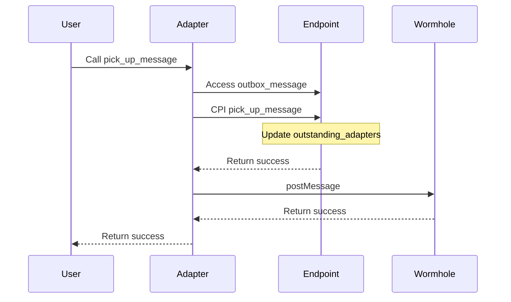
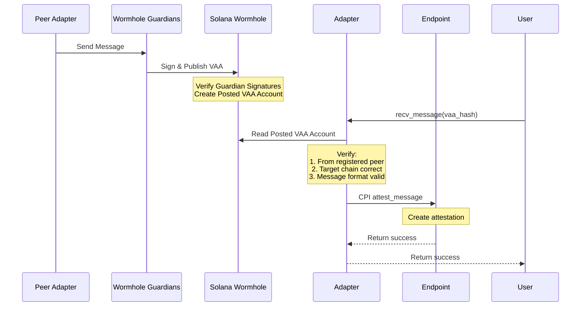

# SVM Documentation

## Design

The WormholeGuardiansAdapter is responsible for picking up and sending messages from the Endpoint, as well as receiving messages for a [Modular Messaging Endpoint](https://github.com/wormholelabs-xyz/example-messaging-endpoint/blob/main/README.md) via the Wormhole core network.

The WormholeGuardiansAdapter program is associated with exactly one Endpoint program. It may be configured to support multiple peer adapters with at most one per chain. All peer contracts must implement the WormholeGuardiansAdapter message format as defined in `GuardianMessage`. The peers are added through the admin instructions on this AdapterProgram. Once a peer is set for a chain, it may not be updated.

It is expected this Adapter program to pick up message from `outbox_message` accounts in Endpoint and send the message via the Wormhole core.



This adapter expects to receive messages from external relayers. If a message is valid, the adapter will attest it to the endpoint.



Note that this adapter does not do replay protection because that is done by the endpoint.

### Initialize Parameters

All of these parameters are part of the program state. They are stored in the `Config` account so anyone may read them.

#### Admin

The Admin Pubkey is used to administer the WormholeGuardiansAdapter. The admin is the only account that is allowed to call `setPeer`. Additionally, only the admin may call `updateAdmin`, `transferAdmin` and `discardAdmin` to update the admin Pubkey.

#### Wormhole Program

The Wormhole program should be set to the canonical Wormhole Core program on this chain. The Wormhole program ID is immutable. The WormholeGuardiansAdapter uses the Wormhole program to send and validate messages.

#### Consistency Level

The `consistency_level` parameter is passed into the `wormhole-anchor-sdk` `post_message` call during the `pick_up_message` invocation. It configures whether the Wormhole network should publish the message when the block is marked confirmed or when the block is finalized. The consistency level is immutable.

### Program Administration:

- The admin pubkey is set during `Initialize` instruction.
- Only the current admin may update the admin.
- The admin privileges may be transferred immediately using `updateAdmin`.
- The admin privileges may be transferred in a two step process using `transferAdmin`. This requires the new admin account to call `claimAdmin` to actually become the admin.
- The current admin may cancel a transfer by calling `claimAdmin`.
- The current admin may discard the admin privileges by calling `discardAdmin`. This makes the WormholeGuardiansAdapter immutable, allowing not further peers to be set. THIS IS NOT REVERSIBLE.

### Other External Instructions

- Anyone may call `pick_up_message` to pick up a message from the `OutboxAccount` from Endpoint and send the message to a given connected peer.
- Anyone may call `receiveMessage` to post a message to the adapter. If the message is valid, the WormholeGuardiansAdapter will call `attestMessage` on the Endpoint.

### Message Format

The payload of the Wormhole messages consists of the following fields encoded using `abi.encodePacked`.

```code
UniversalAddress srcAddr,
uint64 sequence,
uint16 dstChain,
UniversalAddress dstAddr,
bytes32 payloadHash
```

on Solana, the struct looks like:

```rust
pub struct GuardianMessage {
    pub src_addr: UniversalAddress,
    pub sequence: u64,
    pub dst_chain: u16,
    pub dst_addr: UniversalAddress,
    pub payload_hash: [u8; 32],
}
```

## Development

### Features

Below are the descriptions of the instructions, their specifications and tests done for the specifications lists

| Ix Name        | Specifications                                                                                                                                                                                  | Tests                                                                                                                                                    |
| -------------- | ----------------------------------------------------------------------------------------------------------------------------------------------------------------------------------------------- | -------------------------------------------------------------------------------------------------------------------------------------------------------- |
| updateAdmin    | - Caller must be current admin with no pending transfer<br>- New admin cannot be zero address<br>- Immediately sets newAdmin as admin                                                           | [x] Successfully updates admin<br>[x] Fail with CallerNotAdmin<br>[x] Fail with AdminTransferPending<br>[x] Fail with ZeroAddress                        |
| transferAdmin  | - Caller must be current admin with no pending transfer<br>- New admin cannot be zero address<br>- Initiates first step of two-step process                                                     | [x] Successfully initiates transfer<br>[x] Fail with CallerNotAdmin<br>[x] Fail with AdminTransferPending<br>[x] Fail with ZeroAddress                   |
| claimAdmin     | - Caller must be current admin OR pending admin<br>- Must have pending admin transfer<br>- Sets admin to caller and clears pending admin                                                        | [x] Successfully claims as new admin<br>[x] Successfully claims as admin<br>[x] Fail with CallerNotAdmin<br>[x] Fail with NoAdminUpdatePending           |
| setPeer        | - Caller must be current admin<br>- Peer chain cannot be 0<br>- Peer contract cannot be zero address<br>- Cannot set peer if already set                                                        | [x] Success path<br>[x] Fail with CallerNotAdmin<br>[x] Fail with InvalidChain<br>[x] Fail with InvalidPeerZeroAddress<br>[x] Fail with PeerAlreadySet   |
| pickUpMessage  | - Must pick up message from outbox<br>- Must create and post Wormhole message with outbox message data                                                                                          | [x] Can pick up message<br>[x] Creates correct Wormhole message<br>[x] Verifies outbox message is removed                                                |
| receiveMessage | - Message must be valid VAA<br>- Message must come from registered peer<br>- Message must be targeted to this chain<br>- Message must be exactly 106 bytes<br>- Must attest message to endpoint | [x] Successfully attests valid VAA from registered peer<br>[x] Fail with InvalidPeer<br>[x] Fail with InvalidChain<br>[x] Fail with InvalidPayloadLength |
